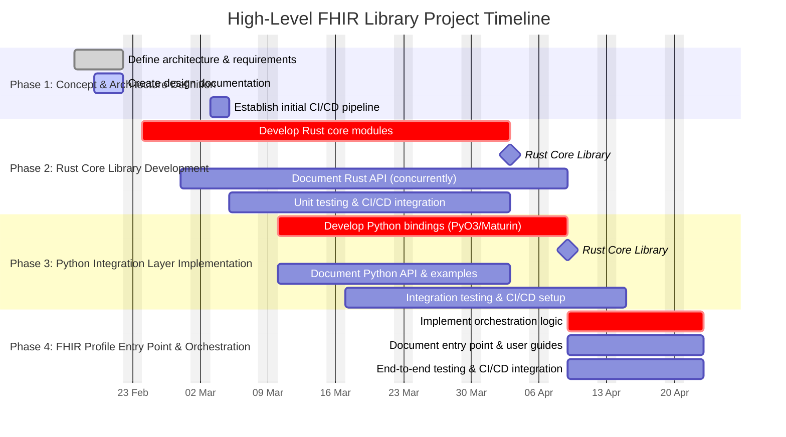
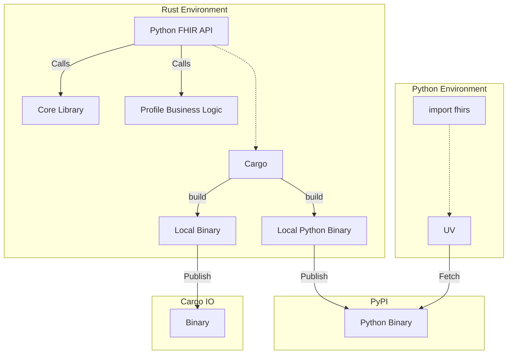

# FHIRs

This project is an internal initiative to build a Rust Fast Healthcare Interoperability Resource (FHIR) library for Python. The solution will provide high-performance FHIR data parsing and validation while exposing a user-friendly Python interface. Beyond solving an immediate need, this project is a strategic investment in Rust expertise for our Organizaiton.

---

## 1. Project Overview

- **Objective:**  
  Develop a FHIR library that validates FHIR profiles and generates resource validators, addressing the shortcomings of the current Python solution.

- **Key Technologies:**  
  - **Rust:**  
    Used for the core implementation to achieve high performance, robust safety, and efficient memory management.
  - **Python:**  
    Provides an accessible API for rapid prototyping and use development in the most popular language of the time of this document

- **Project Expectation:**  
  - To be the nexus for developing inhouse Rust experties.
---

## 2. Architectural Components

### 2.1. Rust Core Library

- **Purpose:**  
  Implements FHIR parsing, validation, and processing logic.
  
- **Benefits:**  
  - High performance and efficient resource management.  
  - Strong memory and thread safety, reducing runtime errors.  
  - Modular design allows for easy updates and future enhancements.

### 2.2. Python Integration Layer

- **Purpose:**  
  Exposes the functionality of the Rust core through a Python API.
  
- **Method:**  
  - Utilize tools like **PyO3** and **Maturin** to build seamless bindings.
  
- **Benefits:**  
  - Enables developers to interact with the high-performance Rust backend using familiar Python syntax.  
  - Bridges our innovative core technology with our existing Python ecosystem(s).

### 2.3. FHIR Profile Entry Point

- **Purpose:**  
  Acts as the orchestrator that accepts FHIR profiles and produces resource validators.
  
- **Benefits:**  
  - Provides a declaritive interface for FHIR validation configuration. (that already exists and is standarise)
  - Provides a flexible entry point to validate diverse healthcare data profiles (formats).

---

## 3. Repository and Development Structure

### 3.1. Repository Organization

- **Initial Structure:**  
  - **Monorepo:**  
    Consolidate the Rust core and Python integration layers in a single repository for streamlined development, testing, and coordination.
  
- **Future Considerations:**  
  - If regional customizations or separate release cycles become necessary, we can re-evaluate the structure (e.g., splitting into polyrepos).

### 3.2. Development and Testing Pipeline

- **Tools:**  
  - Use **Cargo** and **Maturin** to automate builds and package the solution.
  
- **Testing:**  
  - Implement robust unit tests for the Rust core.  
  - Set up integration tests to ensure the Python bindings work seamlessly with the core functionality.

---

## 4. Value Proposition and Strategic Investment

- **Operational Efficiency:**  
  Rust’s performance will result in faster processing and lower operational costs compared to legacy Python solution.

- **Innovation and Future-Proofing:**  
  Investing in Rust expertise now will not only improve this project’s quality but also empower our company with Domain Specific Language (DSL) in order to tackle more advanced, performance-critical projects in the future.

- **Competitive Advantage:**  
  Developing cutting-edge technology internally reinforces our reputation as a forward-thinking, agile unit ready to adopt and master modern technologies.

---

## 5. Next Steps and Detailed Breakdown

### Phase 1: Concept & Architecture Definition

- **Objectives:**
  - Finalize high-level system architecture and define overall technical requirements.
  - Identify core components (Rust core, Python integration, FHIR entry point) and their interactions.
- **Key Activities:**
  - **Documentation:** Create detailed design documents and technical specifications.
  - **CI/CD Setup:** Establish an initial CI/CD pipeline for code quality checks and static analysis to support future development.
- **Outcome:**  
  A comprehensive architecture blueprint with baseline automated quality assurance processes in place.

### Phase 2: Rust Core Library Development

- **Objectives:**
  - Develop the core FHIR parsing, validation, and processing modules in Rust.
- **Key Activities:**
  - **Development:** Build modular components with clear interfaces.
  - **Documentation:** Document each module and API as you code.
  - **CI/CD Integration:**  
    - Write unit tests for each module.
    - Integrate an automated pipeline to run tests on every commit.
- **Outcome:**  
  A stable, well-documented, and continuously tested Rust core library.

### Phase 3: Python Integration Layer Implementation

- **Objectives:**
  - Expose the Rust core functionality through a user-friendly Python API.
- **Key Activities:**
  - **Development:** Use tools like PyO3 and Maturin to create Python bindings.
  - **Documentation:** Provide clear API documentation and usage examples alongside the code.
  - **CI/CD Integration:**  
    - Develop integration tests to ensure seamless interaction between Rust and Python components.
    - Set up a CI/CD pipeline that runs these tests on every update.
- **Outcome:**  
  A robust Python interface that reliably bridges the high-performance Rust core with ease of use for developers.

### Phase 4: FHIR Profile Entry Point & Orchestration

- **Objectives:**
  - Build the entry point that accepts FHIR profiles and produces resource validators.
- **Key Activities:**
  - **Development:** Implement flexible orchestration logic to handle regional or custom FHIR configurations.
  - **Documentation:** Develop comprehensive API documentation, tutorials, and user guides for the entry point.
  - **CI/CD Integration:**  
    - Create end-to-end tests that simulate FHIR profile processing.
    - Integrate these tests into the CI/CD pipeline to ensure the entire workflow is robust.
- **Outcome:**  
  A flexible and well-documented FHIR validation orchestration component, fully integrated and continuously tested.

### Continuous Activities Across All Phases

- **Documentation:**  
  Every phase includes ongoing creation and refinement of documentation. This ensures that design decisions, module interfaces, and usage instructions remain up to date.
- **CI/CD Pipelines:**  
  From Phase 2 onward, automated testing and deployment processes are embedded in each phase. These pipelines provide immediate feedback on code quality, functionality, and integration.
- **Iteration and Improvement:**  
  Feedback from testing and documentation reviews is continuously incorporated. This iterative process helps refine the architecture, streamline development, and address issues early.

---

This high-level design serves as our roadmap, aligning technical decisions with strategic business objectives. It demonstrates that by investing in Rust expertise, we are not only building a superior FHIR library but also preparing our department for future innovation and competitive advantage.

## Interoperability and Flow

### Rust Environment:

- **Cargo** builds two artifacts:
  - **A Local Binary** for Rust projects (published via Cargo IO).
  - **A Local Python** Binary (wrapped with PyO3) for Python usage.
- The **Core Library** handles high-performance FHIR processing, while the **Python FHIR API** and **Profile Business Logic** provide the domain-specific and integration layers.

### Distribution:

- The **Local Python Binary** is published to PyPI as a Python Binary, allowing developers to simply import the module (import fhirs) in their projects.
- The **Local Binary** is published via Cargo IO for other Rust-based needs.
